# Design Document: AI Recruitment Intelligence Platform

## Overview

The AI Recruitment Intelligence Platform is a candidate-ranking system that replaces keyword matching with semantic understanding, AI reasoning, and explainable scoring. Instead of behaving like a traditional Applicant Tracking System (ATS) that filters resumes by string matches, the platform interprets the *intent* behind a Job Description (JD), extracts structured meaning from unstructured resumes, embeds both into a shared vector space, and ranks candidates by semantic fit augmented with behavioral signals and a reasoning layer that produces human-readable justifications for every score.

The architecture is intentionally separated into five tiers — frontend, backend (orchestration/API), AI services, vector search, and persistent storage — so each concern can scale and evolve independently. The AI tier is built as a composable pipeline of stages (JD understanding → resume parsing → embedding → semantic matching → behavioral scoring → explainable re-ranking), where each stage is a pure, independently testable transformation. This modularity supports the hackathon goal of demonstrating capability quickly while leaving a clean path to production hardening (autoscaling, async workers, observability, and model governance).

This document combines a **high-level design** (architecture diagrams, service decomposition, data models, API and data flow) with a **low-level design** (algorithmic pseudocode, formal specifications, and key function signatures). All algorithmic detail is expressed in Structured Pseudocode, since the project is language-agnostic at the architecture stage. A recommended technology stack with justifications is included, but the pseudocode itself is implementation-neutral.

---

## Goals and Non-Goals

**Goals**
- Semantic, intent-aware matching of candidates to job descriptions.
- Explainable rankings: every score is decomposable and defensible.
- Clean separation of frontend, backend, AI services, vector search, and databases.
- Modular AI pipeline where each stage is independently testable and swappable.
- A design that scales horizontally and is production-deployable later.

**Non-Goals (for the hackathon scope)**
- Building the implementation code (this is architecture only).
- Full HR compliance/audit certification (designed for, not delivered).
- Automated hiring decisions — the platform *ranks and explains*; humans decide.

---

## Architecture

### High-Level System Architecture

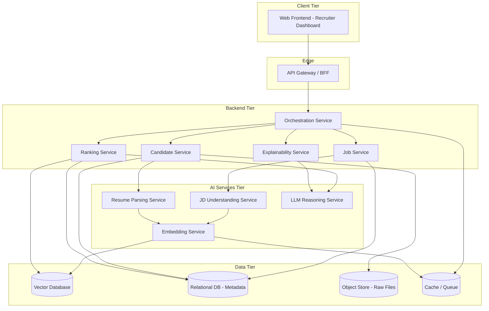

**Why this shape:** The three logical tiers (Backend, AI, Data) are split so that compute-heavy AI work scales separately from request-handling backend logic and from stateful storage. The API Gateway / BFF (Backend-for-Frontend) isolates the UI from internal service topology, enabling internal refactors without breaking clients.

### Tier Responsibilities

| Tier | Responsibility | Why it exists |
|------|----------------|---------------|
| **Frontend** | Recruiter dashboard: upload JDs/resumes, view ranked candidates, drill into explanations | Humans need an interface to act on intelligence; keeps presentation decoupled from logic |
| **API Gateway / BFF** | AuthN/AuthZ, request shaping, rate limiting, aggregation | Single entry point; shields internal services; centralizes cross-cutting concerns |
| **Backend Services** | Domain orchestration, persistence, business rules | Stateful coordination and CRUD that should not live in AI compute |
| **AI Services** | JD understanding, parsing, embedding, reasoning | Heavy, GPU/LLM-bound work that scales and fails independently |
| **Vector Search** | Approximate nearest-neighbor (ANN) retrieval over embeddings | Sub-linear semantic similarity at scale; impossible efficiently in a relational DB |
| **Databases** | Structured metadata, raw documents, caching | Durable source of truth + fast retrieval + large blob storage |

---

## Folder Structure

A monorepo organized by deployable service, keeping each tier independently buildable and deployable.

```
ai-recruitment-intelligence-platform/
├── apps/
│   ├── web/                     # Frontend (recruiter dashboard)
│   │   ├── src/
│   │   │   ├── components/       # Ranking cards, explanation panels, upload widgets
│   │   │   ├── pages/            # Jobs, Candidates, Ranking, Job Detail
│   │   │   ├── features/         # Feature-scoped state + API hooks
│   │   │   ├── services/         # API client wrappers
│   │   │   └── lib/              # Formatting, score visualization helpers
│   │   └── tests/
│   └── api-gateway/             # BFF: auth, aggregation, rate limiting
│       ├── src/routes/
│       ├── src/middleware/
│       └── tests/
├── services/
│   ├── orchestration/           # Pipeline coordinator (sagas / workflows)
│   ├── job-service/             # JD CRUD + structured JD store
│   ├── candidate-service/       # Candidate/resume CRUD + raw file refs
│   ├── ranking-service/         # Retrieval + scoring + re-ranking
│   ├── explainability-service/  # Generates human-readable justifications
│   └── ai/
│       ├── jd-understanding/    # JD → structured requirements
│       ├── resume-parsing/      # Resume → structured profile
│       ├── embedding/           # Text → vectors
│       └── reasoning/           # LLM reasoning + explanation generation
├── packages/                    # Shared, versioned internal libraries
│   ├── domain-models/           # Canonical types: Job, Candidate, Score, Explanation
│   ├── schemas/                 # Validation schemas / contracts
│   ├── prompt-templates/        # Versioned LLM prompt assets
│   ├── scoring/                 # Pure scoring + ranking functions
│   └── telemetry/               # Logging, tracing, metrics helpers
├── infra/
│   ├── docker/                  # Per-service containers
│   ├── k8s/                     # Deployment manifests / Helm charts
│   └── pipelines/               # CI/CD definitions
├── docs/
│   └── architecture/            # ADRs, diagrams, this design
└── .kiro/                       # Spec workspace
```

**Why this structure:** `apps/` holds user-facing deployables, `services/` holds backend + AI microservices, and `packages/` holds shared pure logic (domain models, scoring math, prompt templates) so that the same canonical types and scoring rules are reused everywhere, preventing drift between services.

---

## Components and Interfaces

### Component 1: API Gateway / BFF

**Purpose**: Single, authenticated entry point for the frontend; aggregates backend calls and enforces cross-cutting concerns.

**Interface**:
```pascal
INTERFACE ApiGateway
  PROCEDURE authenticate(request): AuthContext
  PROCEDURE createJob(authCtx, jobPayload): JobId
  PROCEDURE uploadCandidate(authCtx, jobId, resumeFile): CandidateId
  PROCEDURE getRanking(authCtx, jobId, page): RankedCandidatePage
  PROCEDURE getExplanation(authCtx, jobId, candidateId): Explanation
END INTERFACE
```

**Responsibilities**:
- Verify identity and authorization scope before forwarding.
- Rate-limit and validate inbound payloads.
- Aggregate ranking + explanation data for dashboard views.

### Component 2: Orchestration Service

**Purpose**: Coordinates the multi-stage AI pipeline as a durable workflow, ensuring each candidate flows through parse → embed → index, and each ranking request flows through retrieve → score → reason → explain.

**Interface**:
```pascal
INTERFACE OrchestrationService
  PROCEDURE ingestJob(jobId): JobIngestResult
  PROCEDURE ingestCandidate(candidateId, jobId): CandidateIngestResult
  PROCEDURE runRanking(jobId, options): RankingJobHandle
  PROCEDURE getRankingStatus(handle): RankingStatus
END INTERFACE
```

**Responsibilities**:
- Sequence pipeline stages and handle retries/compensation on failure.
- Emit progress events so the UI can show ingestion/ranking status.
- Enforce idempotency so re-ingesting the same resume does not duplicate work.

### Component 3: Job Service

**Purpose**: Owns Job Descriptions and their AI-derived structured requirements.

**Interface**:
```pascal
INTERFACE JobService
  PROCEDURE createJob(rawJobDescription, metadata): Job
  PROCEDURE attachStructuredRequirements(jobId, requirements): VOID
  PROCEDURE getJob(jobId): Job
  PROCEDURE listJobs(filter): List<Job>
END INTERFACE
```

**Responsibilities**: Persist raw + structured JD; expose JD requirement vectors for matching.

### Component 4: Candidate Service

**Purpose**: Owns candidate records, raw resume files, and AI-derived structured profiles. Supports many candidate profiles per job.

**Interface**:
```pascal
INTERFACE CandidateService
  PROCEDURE registerCandidate(jobId, resumeFileRef, metadata): Candidate
  PROCEDURE attachStructuredProfile(candidateId, profile): VOID
  PROCEDURE getCandidate(candidateId): Candidate
  PROCEDURE listCandidatesForJob(jobId, filter): List<Candidate>
END INTERFACE
```

**Responsibilities**: Persist raw resume reference (object store) + structured profile; track behavioral signals.

### Component 5: Ranking Service

**Purpose**: Produces ordered candidate lists by combining vector similarity, behavioral signals, and LLM reasoning adjustments.

**Interface**:
```pascal
INTERFACE RankingService
  PROCEDURE rank(jobId, candidateIds, weights): List<ScoredCandidate>
  PROCEDURE retrieveCandidates(jobVector, topK): List<CandidateMatch>
END INTERFACE
```

**Responsibilities**: ANN retrieval, multi-factor score composition, deterministic ordering, tie-breaking.

### Component 6: Explainability Service

**Purpose**: Converts numeric score components into human-readable, evidence-backed justifications.

**Interface**:
```pascal
INTERFACE ExplainabilityService
  PROCEDURE explain(job, candidate, scoreBreakdown): Explanation
END INTERFACE
```

**Responsibilities**: Map each score factor to concrete resume/JD evidence; generate natural-language rationale; surface strengths, gaps, and risks.

### Component 7: AI Services (JD Understanding, Resume Parsing, Embedding, Reasoning)

**Purpose**: Stateless transformation services that wrap models.

**Interface**:
```pascal
INTERFACE JdUnderstandingService
  PROCEDURE analyze(rawJobDescription): StructuredRequirements
END INTERFACE

INTERFACE ResumeParsingService
  PROCEDURE parse(rawResumeText): StructuredProfile
END INTERFACE

INTERFACE EmbeddingService
  PROCEDURE embed(text): Vector
  PROCEDURE embedBatch(texts): List<Vector>
END INTERFACE

INTERFACE ReasoningService
  PROCEDURE assessFit(requirements, profile): FitAssessment
  PROCEDURE generateRationale(requirements, profile, scoreBreakdown): Text
END INTERFACE
```

**Responsibilities**: Pure model invocation; no business state; horizontally scalable behind queues.

---

## Data Models

### Model 1: Job

```pascal
STRUCTURE Job
  id: UUID
  title: String
  rawDescription: Text
  structuredRequirements: StructuredRequirements
  requirementVector: Vector
  status: Enum { DRAFT, ANALYZED, RANKING_READY }
  createdAt: Timestamp
END STRUCTURE
```

**Validation Rules**:
- `rawDescription` non-empty.
- `requirementVector` present only when `status >= ANALYZED`.

### Model 2: StructuredRequirements

```pascal
STRUCTURE StructuredRequirements
  mustHaveSkills: List<SkillRequirement>
  niceToHaveSkills: List<SkillRequirement>
  minYearsExperience: Number
  seniorityLevel: Enum { JUNIOR, MID, SENIOR, LEAD, PRINCIPAL }
  responsibilities: List<String>
  domain: String
  implicitSignals: List<String>   // inferred intent, e.g. "startup pace", "ownership"
END STRUCTURE

STRUCTURE SkillRequirement
  name: String
  weight: Number        // 0.0 - 1.0 relative importance
  required: Boolean
END STRUCTURE
```

**Validation Rules**: each `weight` in `[0,1]`; `mustHaveSkills` weights default high.

### Model 3: Candidate

```pascal
STRUCTURE Candidate
  id: UUID
  jobId: UUID
  rawResumeRef: ObjectStoreKey
  structuredProfile: StructuredProfile
  profileVector: Vector
  behavioralSignals: BehavioralSignals
  createdAt: Timestamp
END STRUCTURE
```

### Model 4: StructuredProfile

```pascal
STRUCTURE StructuredProfile
  skills: List<SkillEvidence>
  totalYearsExperience: Number
  roles: List<RoleHistory>
  education: List<EducationRecord>
  projects: List<ProjectRecord>
  domains: List<String>
END STRUCTURE

STRUCTURE SkillEvidence
  name: String
  yearsUsed: Number
  recencyMonths: Number     // months since last used
  evidenceSpans: List<TextSpan>   // where in resume this was found
END STRUCTURE
```

**Validation Rules**: every `SkillEvidence` must carry at least one `evidenceSpan` to support explainability.

### Model 5: BehavioralSignals

```pascal
STRUCTURE BehavioralSignals
  jobStabilityScore: Number   // tenure consistency, 0-1
  growthTrajectoryScore: Number  // promotion / scope growth, 0-1
  impactScore: Number         // quantified achievements present, 0-1
  recencyScore: Number        // recent relevant activity, 0-1
END STRUCTURE
```

### Model 6: Scoring Output

```pascal
STRUCTURE ScoreBreakdown
  semanticScore: Number       // 0-1 from vector similarity
  skillCoverageScore: Number  // 0-1 weighted skill match
  behavioralScore: Number     // 0-1 aggregate behavioral
  reasoningAdjustment: Number  // -0.2..+0.2 from LLM nuance
  finalScore: Number          // 0-1 composite
  factorContributions: Map<String, Number>
END STRUCTURE

STRUCTURE ScoredCandidate
  candidateId: UUID
  scoreBreakdown: ScoreBreakdown
  rank: Number
END STRUCTURE

STRUCTURE Explanation
  candidateId: UUID
  summary: Text
  strengths: List<EvidenceItem>
  gaps: List<EvidenceItem>
  risks: List<EvidenceItem>
  factorNarratives: Map<String, Text>
END STRUCTURE
```

---

## AI Pipeline

The AI pipeline is the core intelligence. It is decomposed into two flows: an **ingestion flow** (runs per JD and per candidate) and a **ranking flow** (runs per ranking request).

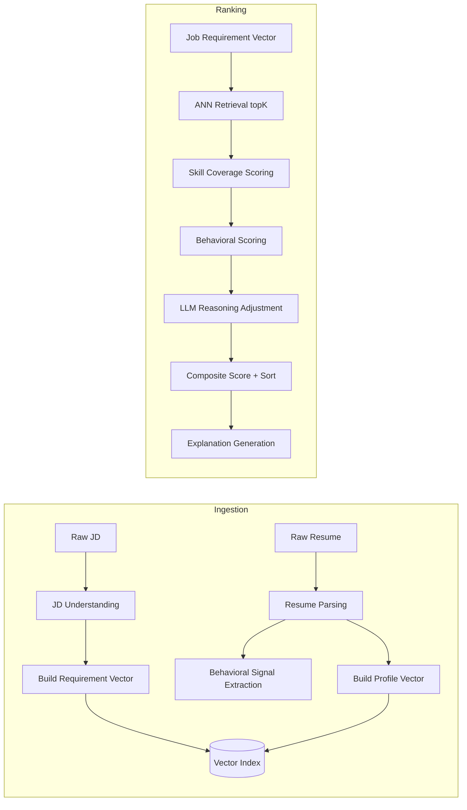

**Pipeline stages and why each exists:**

1. **JD Understanding** — turns prose into structured, weighted requirements and *implicit intent*. Exists because matching against raw text loses the relative importance and unstated expectations of a role.
2. **Resume Parsing** — converts unstructured resumes into evidence-bearing structured profiles. Exists to enable both scoring and explainability (evidence spans).
3. **Embedding** — projects JD requirements and candidate profiles into a shared semantic space. Exists to enable similarity beyond keywords.
4. **Behavioral Signal Extraction** — derives stability/growth/impact/recency. Exists because two equally "skilled" candidates differ in trajectory and reliability.
5. **ANN Retrieval** — fast top-K semantic candidate retrieval. Exists to scale to large candidate pools sub-linearly.
6. **Reasoning Adjustment** — LLM applies nuance the vectors miss (e.g., adjacent-domain transfer, over/under-qualification). Exists to refine, not replace, quantitative scores within a bounded range.
7. **Explanation Generation** — produces evidence-backed rationale. Exists to satisfy the explainable-AI requirement and recruiter trust.

---

## Low-Level Design: Algorithmic Pseudocode

This section specifies the key algorithms with preconditions, postconditions, and loop invariants. All pseudocode is implementation-neutral Structured Pseudocode.

### Algorithm 1: JD Understanding

```pascal
ALGORITHM analyzeJobDescription(rawJD)
INPUT: rawJD of type Text
OUTPUT: requirements of type StructuredRequirements

BEGIN
  ASSERT rawJD ≠ EMPTY

  // Step 1: Extract candidate requirement statements via LLM with a versioned prompt
  rawExtraction ← LLM.extractRequirements(promptTemplate("jd_understanding"), rawJD)

  // Step 2: Normalize and deduplicate skills
  skills ← normalizeSkills(rawExtraction.skills)

  // Step 3: Assign weights (required = high baseline, nice-to-have = lower)
  FOR each skill IN skills DO
    ASSERT skill.weight IS UNSET
    IF skill.required THEN
      skill.weight ← clamp(rawExtraction.importance[skill.name], 0.5, 1.0)
    ELSE
      skill.weight ← clamp(rawExtraction.importance[skill.name], 0.0, 0.5)
    END IF
  END FOR

  // Step 4: Capture implicit intent (e.g., "ownership", "fast-paced")
  requirements ← buildRequirements(skills, rawExtraction.experience,
                                   rawExtraction.seniority, rawExtraction.implicitSignals)

  ASSERT requirements.mustHaveSkills IS NOT EMPTY OR requirements.responsibilities IS NOT EMPTY
  RETURN requirements
END
```

**Preconditions:** `rawJD` is a non-empty text document.
**Postconditions:** Returns structured requirements where every skill has a weight in `[0,1]`; required-skill weights ≥ 0.5.
**Loop Invariant:** After processing each skill, all previously processed skills have a defined weight in the valid range.

### Algorithm 2: Resume Parsing

```pascal
ALGORITHM parseResume(rawResumeText)
INPUT: rawResumeText of type Text
OUTPUT: profile of type StructuredProfile

BEGIN
  ASSERT rawResumeText ≠ EMPTY

  sections ← segmentResume(rawResumeText)   // experience, education, skills, projects
  skills ← EMPTY_LIST

  FOR each mention IN extractSkillMentions(sections) DO
    ASSERT mention.span IS WITHIN rawResumeText
    evidence ← buildSkillEvidence(mention.name, mention.span,
                                  computeYearsUsed(mention), computeRecency(mention))
    skills ← upsertSkill(skills, evidence)   // merge duplicate skill names, keep all spans
  END FOR

  roles      ← extractRoleHistory(sections.experience)
  education  ← extractEducation(sections.education)
  projects   ← extractProjects(sections.projects)
  totalYears ← computeTotalExperience(roles)

  profile ← buildProfile(skills, totalYears, roles, education, projects)

  ASSERT FOR ALL s IN profile.skills: s.evidenceSpans IS NOT EMPTY
  RETURN profile
END
```

**Preconditions:** `rawResumeText` non-empty (already extracted from the uploaded file).
**Postconditions:** Every skill in the profile carries at least one evidence span (required for explainability).
**Loop Invariant:** After each skill mention is processed, all merged skills in `skills` retain every evidence span discovered so far.

### Algorithm 3: Embedding Construction

```pascal
ALGORITHM buildEntityVector(structuredEntity)
INPUT: structuredEntity (StructuredRequirements OR StructuredProfile)
OUTPUT: vector of type Vector

BEGIN
  // Compose a canonical text representation emphasizing weighted/important elements
  canonicalText ← serializeForEmbedding(structuredEntity)
  ASSERT canonicalText ≠ EMPTY

  vector ← EmbeddingService.embed(canonicalText)

  ASSERT length(vector) = MODEL_DIMENSION
  ASSERT isNormalized(vector)   // unit length for cosine similarity
  RETURN vector
END
```

**Preconditions:** Structured entity is non-empty and validated.
**Postconditions:** Returns a unit-normalized vector of fixed model dimension.
**Loop Invariant:** N/A (no loop).

### Algorithm 4: Candidate Retrieval (ANN)

```pascal
ALGORITHM retrieveCandidates(jobVector, jobId, topK)
INPUT: jobVector of type Vector, jobId of type UUID, topK of type Number
OUTPUT: matches of type List<CandidateMatch>  (size ≤ topK)

BEGIN
  ASSERT isNormalized(jobVector)
  ASSERT topK > 0

  matches ← VectorDB.annSearch(
              queryVector = jobVector,
              filter = { jobId = jobId },
              k = topK,
              metric = COSINE)

  // matches arrive sorted by similarity descending from the index
  ASSERT FOR ALL i IN [1 .. length(matches)-1]:
           matches[i-1].similarity >= matches[i].similarity

  RETURN matches
END
```

**Preconditions:** `jobVector` normalized; `topK` positive; candidate vectors indexed under `jobId`.
**Postconditions:** Returns at most `topK` matches sorted by descending cosine similarity.
**Loop Invariant:** N/A (ordering guaranteed by index; asserted post-condition).

### Algorithm 5: Skill Coverage Scoring

```pascal
ALGORITHM scoreSkillCoverage(requirements, profile)
INPUT: requirements of type StructuredRequirements, profile of type StructuredProfile
OUTPUT: coverage of type Number in [0,1]

BEGIN
  totalWeight   ← 0
  matchedWeight ← 0

  FOR each req IN requirements.mustHaveSkills ∪ requirements.niceToHaveSkills DO
    INVARIANT matchedWeight <= totalWeight
    totalWeight ← totalWeight + req.weight

    evidence ← findSkill(profile.skills, req.name)   // semantic, not exact match
    IF evidence ≠ NULL THEN
      // Reward recency and depth, capped at the requirement weight
      factor ← proficiencyFactor(evidence.yearsUsed, evidence.recencyMonths)
      matchedWeight ← matchedWeight + req.weight * factor
    END IF
  END FOR

  IF totalWeight = 0 THEN
    RETURN 0
  END IF

  coverage ← matchedWeight / totalWeight
  ASSERT coverage >= 0 AND coverage <= 1
  RETURN coverage
END
```

**Preconditions:** Both `requirements` and `profile` are validated structured entities.
**Postconditions:** Returns a value in `[0,1]`; 0 when there are no weighted requirements.
**Loop Invariant:** `matchedWeight ≤ totalWeight` holds before and after each iteration, guaranteeing the final ratio stays in `[0,1]`.

### Algorithm 6: Behavioral Scoring

```pascal
ALGORITHM scoreBehavioral(signals, weights)
INPUT: signals of type BehavioralSignals, weights of type BehavioralWeights
OUTPUT: score of type Number in [0,1]

BEGIN
  ASSERT sumOf(weights) = 1.0

  score ← weights.stability  * signals.jobStabilityScore
        + weights.growth     * signals.growthTrajectoryScore
        + weights.impact     * signals.impactScore
        + weights.recency    * signals.recencyScore

  ASSERT score >= 0 AND score <= 1
  RETURN score
END
```

**Preconditions:** All signal components in `[0,1]`; behavioral weights sum to 1.0.
**Postconditions:** Weighted average stays in `[0,1]`.
**Loop Invariant:** N/A.

### Algorithm 7: Composite Ranking

```pascal
ALGORITHM rankCandidates(job, candidates, weights)
INPUT: job of type Job, candidates of type List<Candidate>, weights of type ScoreWeights
OUTPUT: ranked of type List<ScoredCandidate>

BEGIN
  ASSERT weights.semantic + weights.skill + weights.behavioral = 1.0
  scored ← EMPTY_LIST

  FOR each c IN candidates DO
    INVARIANT FOR ALL s IN scored: s.scoreBreakdown.finalScore IS DEFINED AND IN [0,1]

    semantic   ← cosineSimilarity(job.requirementVector, c.profileVector)  // already in [0,1]
    skill      ← scoreSkillCoverage(job.structuredRequirements, c.structuredProfile)
    behavioral ← scoreBehavioral(c.behavioralSignals, weights.behavioralWeights)

    base ← weights.semantic * semantic
          + weights.skill * skill
          + weights.behavioral * behavioral

    adjustment ← ReasoningService.assessFit(job.structuredRequirements,
                                             c.structuredProfile).adjustment
    adjustment ← clamp(adjustment, -0.2, 0.2)   // bound LLM influence

    finalScore ← clamp(base + adjustment, 0, 1)

    breakdown ← buildScoreBreakdown(semantic, skill, behavioral, adjustment, finalScore)
    scored ← append(scored, ScoredCandidate(c.id, breakdown))
  END FOR

  // Deterministic ordering: finalScore desc, then skill desc, then candidateId asc (tie-break)
  ranked ← stableSort(scored, BY finalScore DESC, skill DESC, candidateId ASC)
  FOR i FROM 0 TO length(ranked)-1 DO
    ranked[i].rank ← i + 1
  END FOR

  ASSERT FOR ALL i IN [1 .. length(ranked)-1]:
           ranked[i-1].scoreBreakdown.finalScore >= ranked[i].scoreBreakdown.finalScore
  RETURN ranked
END
```

**Preconditions:** Score weights sum to 1.0; each candidate has a profile vector and structured profile.
**Postconditions:** Returns candidates ordered by descending final score with deterministic tie-breaking; every final score in `[0,1]`; ranks are 1-based and contiguous.
**Loop Invariant:** Every candidate already placed in `scored` has a defined final score within `[0,1]`.

### Algorithm 8: Explanation Generation

```pascal
ALGORITHM generateExplanation(job, candidate, breakdown)
INPUT: job of type Job, candidate of type Candidate, breakdown of type ScoreBreakdown
OUTPUT: explanation of type Explanation

BEGIN
  strengths ← EMPTY_LIST
  gaps      ← EMPTY_LIST
  risks     ← EMPTY_LIST

  FOR each req IN job.structuredRequirements.mustHaveSkills DO
    evidence ← findSkill(candidate.structuredProfile.skills, req.name)
    IF evidence ≠ NULL THEN
      strengths ← append(strengths, EvidenceItem(req.name, evidence.evidenceSpans))
    ELSE
      gaps ← append(gaps, EvidenceItem(req.name, NO_EVIDENCE))
    END IF
  END FOR

  IF candidate.behavioralSignals.jobStabilityScore < STABILITY_THRESHOLD THEN
    risks ← append(risks, EvidenceItem("job_stability", candidate.roles))
  END IF

  // Narrative grounded ONLY in computed factors + evidence (no hallucinated claims)
  narrative ← ReasoningService.generateRationale(job.structuredRequirements,
                                                 candidate.structuredProfile, breakdown)

  explanation ← buildExplanation(candidate.id, narrative, strengths, gaps, risks,
                                 factorNarratives(breakdown))

  ASSERT explanation.summary ≠ EMPTY
  ASSERT every strength references at least one evidence span
  RETURN explanation
END
```

**Preconditions:** `breakdown` was produced by `rankCandidates`; candidate profile carries evidence spans.
**Postconditions:** Returns a non-empty explanation where every claimed strength is backed by evidence spans; gaps and risks are explicitly listed.
**Loop Invariant:** After each must-have requirement is processed, every requirement seen so far has been classified as either a strength (with evidence) or a gap.

### Key Function Signatures (Service Layer)

```pascal
// Orchestration
FUNCTION ingestCandidate(candidateId: UUID, jobId: UUID): CandidateIngestResult
FUNCTION runRanking(jobId: UUID, options: RankingOptions): RankingJobHandle

// Ranking
FUNCTION rank(jobId: UUID, candidateIds: List<UUID>, weights: ScoreWeights): List<ScoredCandidate>
FUNCTION retrieveCandidates(jobVector: Vector, jobId: UUID, topK: Number): List<CandidateMatch>

// AI services
FUNCTION analyze(rawJobDescription: Text): StructuredRequirements
FUNCTION parse(rawResumeText: Text): StructuredProfile
FUNCTION embed(text: Text): Vector
FUNCTION assessFit(req: StructuredRequirements, profile: StructuredProfile): FitAssessment
FUNCTION generateRationale(req: StructuredRequirements, profile: StructuredProfile, breakdown: ScoreBreakdown): Text

// Explainability
FUNCTION explain(job: Job, candidate: Candidate, breakdown: ScoreBreakdown): Explanation
```

---

## API Flow

REST/JSON over the gateway; AI-heavy operations are asynchronous with status polling or events.

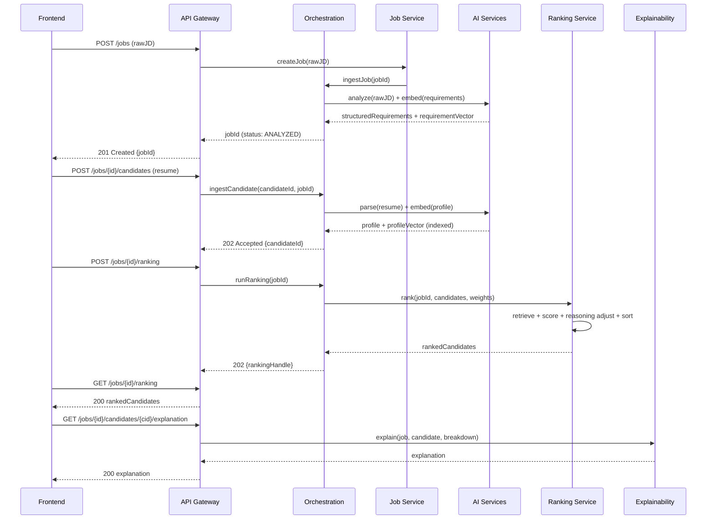

**Representative Endpoints**

| Method | Path | Purpose |
|--------|------|---------|
| POST | `/jobs` | Create + analyze a JD |
| GET | `/jobs/{id}` | Fetch JD + structured requirements |
| POST | `/jobs/{id}/candidates` | Upload + ingest a resume |
| GET | `/jobs/{id}/candidates` | List candidates for a job |
| POST | `/jobs/{id}/ranking` | Trigger ranking run |
| GET | `/jobs/{id}/ranking` | Fetch ranked candidates |
| GET | `/jobs/{id}/candidates/{cid}/explanation` | Fetch explanation |

---

## Data Flow

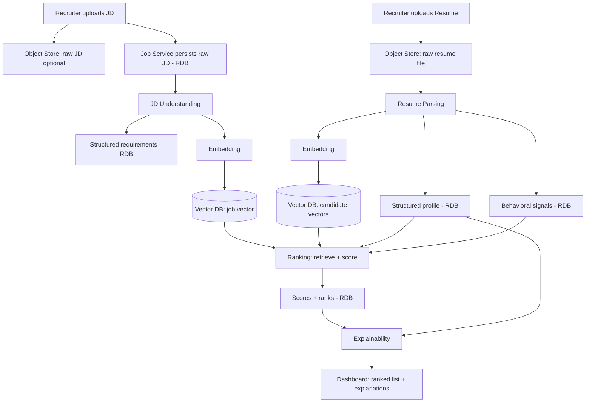

**Why split storage this way:** Raw files live in an object store (cheap, large blobs), structured/relational metadata lives in a relational DB (queryable source of truth), and embeddings live in a vector DB (semantic retrieval). Each store is optimized for its access pattern.

---

## Database Architecture

### Relational Database (source of truth for metadata)
Stores Jobs, StructuredRequirements, Candidates, StructuredProfiles, BehavioralSignals, ScoreBreakdowns, and ranking runs. Chosen for strong consistency, relational queries (candidates-per-job, ranking history), and transactional integrity.

### Vector Database (semantic index)
Stores job requirement vectors and candidate profile vectors with `jobId` metadata for filtered ANN search. Chosen for sub-linear nearest-neighbor retrieval that a relational DB cannot do efficiently.

### Object Store (raw documents)
Stores original resume/JD files (PDF/DOCX). Referenced by key from the relational DB. Chosen for cheap durable blob storage and to keep large binaries out of the transactional DB.

### Cache / Queue
- **Cache**: hot job vectors, recent ranking results, embedding cache (avoid re-embedding identical text).
- **Queue**: decouples ingestion (parse/embed) from request handling, enabling async scaling and retries.

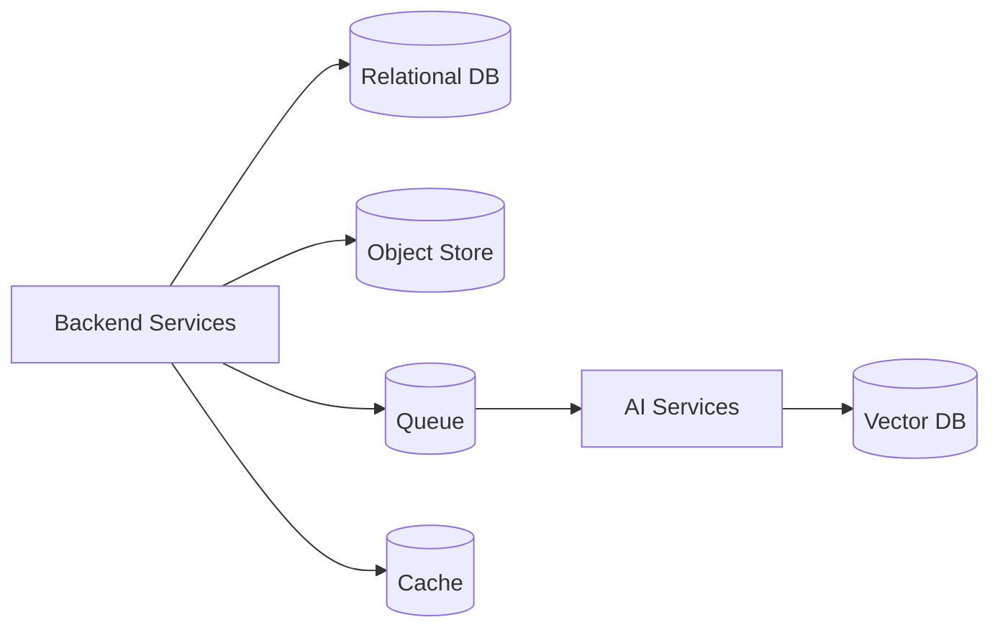

---

## Technology Stack (with justifications)

> These are *recommendations with rationale*. The architecture and pseudocode are stack-agnostic; alternatives are noted so the team can substitute based on hackathon familiarity.

| Layer | Recommended | Why | Alternatives |
|-------|-------------|-----|--------------|
| **Frontend** | React + TypeScript | Largest ecosystem, fast component dev, type safety for score/explanation models | Vue, Svelte |
| **Styling/UI** | Tailwind + a component library | Rapid, consistent dashboard UI under hackathon time pressure | MUI, Chakra |
| **API Gateway / BFF** | Node.js (TypeScript) | Shares types with frontend, excellent for I/O aggregation | Go for higher throughput |
| **Backend services** | Python (FastAPI) | First-class AI/ML ecosystem, async support, easy LLM/SDK integration | Go, Java/Spring |
| **AI orchestration** | LangChain / LlamaIndex-style toolkit | Prompt templating, chaining, retrieval glue out of the box | Custom orchestration |
| **LLM (reasoning/understanding)** | Hosted LLM API (e.g., GPT-class) with prompt versioning | Best reasoning quality fast; no infra to manage for hackathon | Open-weight model (Llama-class) self-hosted for cost/privacy |
| **Embeddings** | Hosted embedding model or open `sentence-transformers` | High-quality semantic vectors; open option avoids API cost | Cohere/Voyage embeddings |
| **Vector DB** | Managed vector store (e.g., Pinecone) or open `pgvector`/Qdrant | ANN at scale with metadata filtering; `pgvector` keeps infra minimal for a hackathon | Weaviate, Milvus |
| **Relational DB** | PostgreSQL | Reliable, rich querying, `pgvector` extension can co-locate vectors early | MySQL |
| **Object Store** | S3-compatible store | Cheap durable blob storage for resumes/JDs | GCS, Azure Blob |
| **Cache/Queue** | Redis + a task queue | Embedding cache + async ingestion workers | RabbitMQ, SQS, Celery |
| **Containerization** | Docker + Kubernetes (later) | Per-service isolation now; orchestration when scaling to production | Docker Compose for hackathon |
| **Observability** | OpenTelemetry + metrics/logs | Trace pipeline stages, debug latency, model governance | Vendor APM |

**Pragmatic hackathon shortcut:** start with PostgreSQL + `pgvector` for *both* metadata and vectors and Docker Compose for orchestration. This collapses two data stores into one and removes Kubernetes overhead, while the service boundaries in this design keep a clean migration path to a dedicated vector DB and Kubernetes for production.

---

## Correctness Properties

For all valid inputs, the following must hold:

### Property 1: Score bounds
For all candidates `c`, `0 ≤ finalScore(c) ≤ 1`.
**Validates: Requirements 3.1, 5.1**

### Property 2: Ranking monotonicity
For all adjacent ranked candidates `i`, `i+1`: `finalScore(rank[i]) ≥ finalScore(rank[i+1])`.
**Validates: Requirements 5.1**

### Property 3: Deterministic tie-breaking
For all candidates with equal `finalScore`, ordering follows the fixed key (skill desc, then candidateId asc), so ranking is reproducible.
**Validates: Requirements 5.1**

### Property 4: Weight conservation
Score weights sum to `1.0` and behavioral weights sum to `1.0`; the composite base score is therefore a valid convex combination in `[0,1]`.
**Validates: Requirements 3.1, 5.1**

### Property 5: Bounded reasoning influence
For all candidates, `reasoningAdjustment ∈ [-0.2, 0.2]`, so the LLM refines but cannot dominate quantitative scoring.
**Validates: Requirements 5.1**

### Property 6: Explainability completeness
For every claimed strength in an `Explanation`, there exists at least one evidence span in the candidate's profile.
**Validates: Requirements 5.1**

### Property 7: Coverage validity
For all (requirements, profile) pairs, `skillCoverageScore ∈ [0,1]`, and equals 0 when total requirement weight is 0.
**Validates: Requirements 3.1**

### Property 8: Embedding invariant
Every stored vector is unit-normalized and has the fixed model dimension.
**Validates: Requirements 3.1**

### Property 9: Idempotent ingestion
Ingesting the same resume content for the same job twice yields one candidate record and one indexed vector (no duplicates).
**Validates: Requirements 2.1, 4.1**

### Property 10: Retrieval ordering
ANN retrieval returns at most `topK` results sorted by descending similarity.
**Validates: Requirements 3.1, 6.1**

---

## Error Handling

### Scenario 1: Unparseable resume
**Condition**: File text extraction fails or yields empty content.
**Response**: Mark candidate as `PARSE_FAILED`, surface to recruiter, do not index a vector.
**Recovery**: Allow re-upload; ingestion is idempotent so retries are safe.

### Scenario 2: AI service timeout / model error
**Condition**: LLM or embedding call fails or times out.
**Response**: Retry with backoff via the queue; if exhausted, fall back to quantitative-only scoring (semantic + skill + behavioral) with `reasoningAdjustment = 0`.
**Recovery**: Ranking still produced; explanation notes reasoning layer was unavailable.

### Scenario 3: No candidates for a job
**Condition**: Ranking requested with zero ingested candidates.
**Response**: Return empty ranked list with explicit status, not an error.
**Recovery**: None needed; UI prompts to upload candidates.

### Scenario 4: Vector dimension mismatch
**Condition**: Embedding model changed dimension between ingestion and ranking.
**Response**: Reject at write time via the embedding invariant assertion; flag for re-embedding.
**Recovery**: Background re-embedding job re-indexes affected vectors under a model version tag.

### Scenario 5: Malformed JD
**Condition**: JD analysis yields no must-have skills and no responsibilities.
**Response**: Reject with a validation error prompting clarification.
**Recovery**: Recruiter edits and resubmits the JD.

---

## Testing Strategy

### Unit Testing
- Pure functions in `packages/scoring` (skill coverage, behavioral, composite) tested against boundary inputs (empty requirements, max/min signals).
- Parsing/normalization helpers tested with representative resume/JD fixtures.

### Property-Based Testing
Validate the Correctness Properties as universal properties over generated inputs.
**Property Test Library**: Hypothesis (Python backend), fast-check (TypeScript gateway).

Properties to encode:
- Generated score components → `finalScore ∈ [0,1]` (Property 1).
- Generated candidate lists → ranked output is monotonically non-increasing (Property 2).
- Equal-score candidates → stable, reproducible ordering (Property 3).
- Random weights normalized to 1.0 → base score stays in `[0,1]` (Property 4).
- Any reasoning adjustment is clamped to `[-0.2, 0.2]` (Property 5).
- Any generated explanation → every strength has evidence (Property 6).

### Integration Testing
- End-to-end ingestion → ranking → explanation flow against a seeded job with synthetic candidates.
- Vector DB filtered retrieval correctness (only candidates of the queried job are returned).
- Async pipeline resilience: inject AI service failures and assert quantitative-only fallback.

---

## Performance Considerations

- **Batch embeddings** during ingestion (`embedBatch`) to amortize model latency.
- **Cache embeddings** keyed by content hash to avoid recomputation on re-ingest.
- **ANN over full scan**: retrieval is sub-linear; only top-K candidates enter the expensive reasoning stage.
- **Bounded reasoning calls**: LLM reasoning runs only on retrieved top-K, not the whole pool.
- **Async workers**: parsing/embedding run off the request path via the queue, keeping the API responsive.
- **Horizontal scaling**: stateless AI services scale by replica count behind the queue.

---

## Security Considerations

- **PII sensitivity**: resumes contain personal data — encrypt at rest (object store + DB) and in transit (TLS).
- **Access control**: gateway enforces tenant/recruiter scoping so a recruiter only sees their jobs/candidates.
- **Bias mitigation**: scoring inputs exclude protected attributes; explanations are evidence-based and auditable to support fairness review. Humans make final decisions.
- **Prompt-injection defense**: treat resume/JD text as untrusted input; reasoning prompts isolate document content and never execute embedded instructions.
- **Audit trail**: persist score breakdowns and prompt/template versions for reproducibility and governance.
- **Secret management**: model API keys held in a secrets manager, never in code or client.

---

## Dependencies

- **LLM provider** (reasoning + JD understanding) — external API or self-hosted open-weight model.
- **Embedding model** — hosted API or local `sentence-transformers`.
- **Vector database** — Pinecone/Qdrant or PostgreSQL + `pgvector`.
- **Relational database** — PostgreSQL.
- **Object store** — S3-compatible service.
- **Cache/queue** — Redis + task queue (Celery/RQ or equivalent).
- **Document text extraction** — PDF/DOCX parsing library.
- **Observability** — OpenTelemetry SDK + metrics/log backend.

---

## Development Phases

**Phase 1 — Foundation (skeleton + contracts)**
- Define `packages/domain-models` and `schemas` (Job, Candidate, Score, Explanation).
- Stand up API Gateway, Job Service, Candidate Service with CRUD against PostgreSQL + object store.
- Docker Compose dev environment.

**Phase 2 — AI Ingestion Pipeline**
- Implement JD Understanding and Resume Parsing (AI services) behind the queue.
- Add Embedding service + vector indexing (start with `pgvector`).
- Idempotent ingestion + behavioral signal extraction.

**Phase 3 — Ranking & Semantic Matching**
- ANN retrieval, skill coverage + behavioral + composite scoring (`packages/scoring`).
- Deterministic ranking with tie-breaking; property-based tests for correctness properties.

**Phase 4 — Explainability & Reasoning**
- LLM reasoning adjustment (bounded) + evidence-backed explanation generation.
- Dashboard explanation panels (strengths/gaps/risks).

**Phase 5 — Hardening & Scale (production path)**
- Migrate to dedicated vector DB + Kubernetes; autoscale AI workers.
- Observability, security (encryption, RBAC, audit), bias review tooling.
- Model/prompt versioning and governance.
```

---

# V2 — AI Engine Layer (Architecture Enhancement)

> This section **extends** the V1 architecture above without rewriting it. Every V1 component (Frontend, API Gateway, Backend Services, AI Services, Vector DB, Relational DB, Resume Parsing, JD Understanding, Embeddings, Semantic Search, Explainability, Candidate Ranking) remains valid. V2 introduces a new **AI Engine Layer** that sits between the existing AI Services tier and the Ranking/Explainability services, turning the platform from a semantic ATS into something that reasons like an **AI Recruiter**.

## V2 Design Philosophy

V1 answered *"how similar is this candidate to this job?"* V2 answers the questions a senior recruiter actually asks: *"who is this person, where are they going, what can't I see on paper, and can I defend ranking them #1?"*

The shift is from **matching** to **judgment**. We achieve this by layering nine specialized engines on top of the existing structured data. Each engine is a **pure, independently testable transformation** that enriches the canonical `Job` and `Candidate` models with new intelligence facets — it never replaces V1 logic, it augments it. The Decision Intelligence Engine then fuses all signals under a **bounded, weight-conserving** formula so no single engine (especially the LLM) can hijack the ranking. The Recruiter Copilot exposes the whole thing through natural language.

**Three principles carried over from V1 and enforced harder in V2:**
1. **Evidence or it didn't happen** — every inferred attribute carries provenance (the resume span, project, or external signal it came from). No hallucinated claims.
2. **Bounded reasoning** — the LLM refines; it never dominates. Confidence is explicit and propagated.
3. **Graceful degradation** — missing data (e.g., no GitHub) lowers confidence, never crashes the pipeline.

---

## Updated High-Level Architecture Diagram

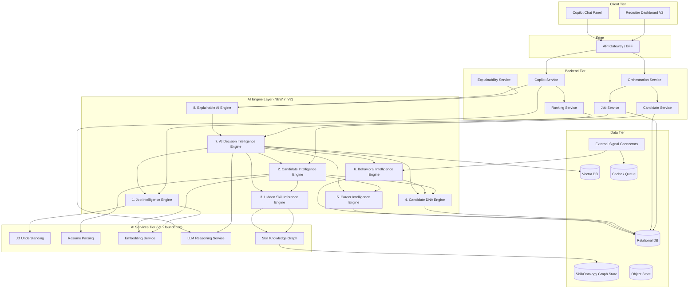

**What changed vs V1:** A dedicated **AI Engine Layer** now sits between Backend Services and the foundational AI Services. Two new stores appear — a **Graph/Ontology store** (skill relationships for hidden-skill inference) and **External Signal Connectors** (GitHub, coding platforms, etc.). Two new backend services appear — the **Copilot Service** and the engines themselves are orchestrated as a pipeline extension. Nothing from V1 was removed.

---

## New AI Engine Layer

Each engine below lists: **Purpose**, **How it works**, **Inputs → Outputs**, and an **Interface**. All engines write their output as enrichments onto the canonical models, tagged with `confidence` and `provenance`.

### Engine 1: Job Intelligence Engine

**Purpose**: Deeply understand a JD's *intent*, not its keywords. Extends V1's `JD Understanding` from skill extraction to multi-dimensional role profiling.

**How it works**: A multi-pass LLM analysis over the raw JD, each pass scoped to one interpretive dimension using a versioned prompt template, then reconciled into a single `JobIntelligenceProfile`. Pass 1 extracts explicit content (required/preferred skills, domain, seniority). Pass 2 infers *implicit* signals through guided reasoning: phrasing like "wear many hats" → startup culture + high ownership; "work with stakeholders across orgs" → enterprise + communication weight; "own the roadmap" → leadership expectation. Each inferred attribute is grounded in the JD span that triggered it, so it is auditable. A calibration step normalizes the dimension weights so they form a usable importance distribution for downstream matching.

**Inputs → Outputs**: `rawJD + V1 StructuredRequirements` → `JobIntelligenceProfile` (required skills, preferred skills, hidden requirements, seniority, leadership expectation, domain knowledge depth, hiring intent, ownership expectation, communication requirement, startup-vs-enterprise culture score, technical complexity, soft-skill profile).

```pascal
INTERFACE JobIntelligenceEngine
  PROCEDURE analyzeJob(rawJD, structuredRequirements): JobIntelligenceProfile
END INTERFACE

STRUCTURE JobIntelligenceProfile
  requiredSkills: List<WeightedSkill>
  preferredSkills: List<WeightedSkill>
  hiddenRequirements: List<InferredAttribute>     // each w/ JD-span provenance
  seniorityLevel: Enum
  leadershipExpectation: Number       // 0-1
  domainKnowledgeDepth: Number        // 0-1
  hiringIntent: Enum { BUILD, SCALE, FIX, RESEARCH, MAINTAIN }
  ownershipExpectation: Number        // 0-1
  communicationRequirement: Number    // 0-1
  cultureAxis: Number                 // 0 = enterprise ... 1 = startup
  technicalComplexity: Number         // 0-1
  softSkills: List<InferredAttribute>
  confidence: Number
END STRUCTURE
```

### Engine 2: Candidate Intelligence Engine

**Purpose**: Convert a resume into *structured intelligence*, not just parsed fields. Extends V1's `Resume Parsing`.

**How it works**: Builds on V1's `StructuredProfile`, then runs enrichment passes that derive higher-order facts: it reconstructs a normalized **career timeline** (resolving overlapping/concurrent roles), clusters technologies into a coherent **tech stack** view, attributes **business impact** by extracting quantified outcomes ("cut latency 40%", "led team of 6"), and tags **leadership experience** from role scope and verbs. Information flows: raw file → V1 parse (sections + skill evidence) → timeline reconstruction → impact/leadership attribution → domain expertise rollup → `CandidateIntelligenceProfile`. Every derived fact retains evidence spans, so the Explainable AI Engine can cite them.

**Inputs → Outputs**: `rawResumeText + V1 StructuredProfile` → `CandidateIntelligenceProfile`.

```pascal
INTERFACE CandidateIntelligenceEngine
  PROCEDURE buildIntelligence(rawResumeText, structuredProfile): CandidateIntelligenceProfile
END INTERFACE

STRUCTURE CandidateIntelligenceProfile
  skills: List<SkillEvidence>
  experience: List<RoleHistory>
  projects: List<ProjectRecord>
  education: List<EducationRecord>
  certifications: List<Certification>
  achievements: List<ImpactStatement>      // quantified, evidence-backed
  careerTimeline: Timeline
  techStack: List<TechCluster>
  domainExpertise: List<DomainScore>
  leadershipExperience: LeadershipProfile
  businessImpact: List<ImpactStatement>
  confidence: Number
END STRUCTURE
```

### Engine 3: Hidden Skill Inference Engine

**Purpose**: The headline innovation. Infer skills the candidate *has* but did **not** write down.

**How it works (inference methodology)**: A **two-source hybrid** that combines a curated **Skill Knowledge Graph** (deterministic, explainable) with **LLM reasoning** (coverage for the long tail), reconciled and confidence-weighted.

1. **Graph propagation (primary, explainable)**: A directed `Skill Ontology Graph` encodes `implies` / `is-part-of` / `co-occurs-with` edges with edge weights (e.g., `LangChain --implies--> RAG (0.9)`, `FAISS --implies--> Vector Databases (0.95)`, `Docker + Kubernetes --implies--> DevOps (0.85)`). For each explicit skill, propagate activation along outgoing edges up to depth `D`, decaying confidence by edge weight per hop. An inferred skill's confidence is the **max activation path** reaching it. This is fully auditable: we can show *"RAG inferred because resume lists LangChain + FAISS + LlamaIndex (3 corroborating sources)"*.
2. **Co-occurrence reinforcement**: When *multiple* explicit skills independently imply the same hidden skill, boost confidence (corroboration), capped at 1.0. Three RAG-adjacent tools → high-confidence RAG.
3. **LLM gap-fill (secondary)**: For implications the graph doesn't encode, the LLM proposes candidate inferences, but each must be re-validated against the graph or evidence before acceptance, and is capped at a lower max confidence than graph-derived inferences.
4. **Threshold + provenance**: Only inferences above `MIN_INFERENCE_CONFIDENCE` are kept; each stores its source skills as provenance.

```pascal
ALGORITHM inferHiddenSkills(explicitSkills, ontology, maxDepth)
INPUT: explicitSkills: List<SkillEvidence>, ontology: SkillGraph, maxDepth: Number
OUTPUT: inferred: List<InferredSkill>

BEGIN
  activation ← MAP()    // skill -> {confidence, sources}
  FOR each s IN explicitSkills DO
    propagate(ontology, s.name, 1.0, maxDepth, sourceOf(s), activation)
  END FOR

  inferred ← EMPTY_LIST
  FOR each (skill, data) IN activation DO
    INVARIANT data.confidence IN [0,1]
    IF NOT isExplicit(skill, explicitSkills)
       AND data.confidence >= MIN_INFERENCE_CONFIDENCE THEN
      inferred ← append(inferred, InferredSkill(skill, data.confidence, data.sources))
    END IF
  END FOR
  RETURN inferred
END

PROCEDURE propagate(graph, skill, conf, depthLeft, source, activation)
BEGIN
  IF depthLeft = 0 THEN RETURN
  FOR each edge IN graph.outgoing(skill) DO
    newConf ← conf * edge.weight          // monotonic decay, stays in [0,1]
    existing ← activation[edge.target]
    IF existing = NULL OR newConf > existing.confidence THEN
      activation[edge.target] ← { confidence: newConf, sources: existing.sources ∪ {source} }
    ELSE
      existing.sources ← existing.sources ∪ {source}   // corroboration tracking
    END IF
    propagate(graph, edge.target, newConf, depthLeft - 1, source, activation)
  END FOR
END
```

**Why this is defensible:** graph-derived inferences are deterministic and explainable ("inferred from X, Y, Z"); the LLM only fills gaps under stricter caps. No skill is ever invented without a traceable source.

### Engine 4: Candidate DNA Engine

**Purpose**: Generate an AI professional *fingerprint* — a small set of archetype tags (Builder, Researcher, Leader, Architect, Problem Solver, Startup Mindset, Enterprise Mindset, AI Specialist, Backend Specialist, Product Thinker, Innovator, Ownership, Fast Learner).

**How it works (DNA computation)**: Each archetype is defined by a **feature signature** — a weighted combination of observable signals from Engines 2/3/5/6. DNA is computed as scored archetype affinities, not a hard label, so a candidate can be 0.8 Builder + 0.6 AI Specialist + 0.4 Leader.

For each archetype `a`, affinity = normalized weighted sum of its contributing features. Examples:
- **Builder** ← (# shipped projects, breadth of tech stack, ownership signals, hands-on recency).
- **Researcher** ← (publications/certifications, depth in narrow domain, experimentation language, novel-tech adoption).
- **Architect** ← (system-design scope, breadth across layers, leadership of technical direction).
- **Startup Mindset** ← (small-team roles, multi-role breadth, 0→1 projects) vs **Enterprise Mindset** ← (large-org tenure, process/scale signals, cross-org collaboration).
- **Fast Learner** ← (skill freshness + tech adoption velocity from Engine 5).
- **AI Specialist** ← (density of AI/ML skills including *inferred* ones from Engine 3).

```pascal
ALGORITHM computeDNA(intel, hiddenSkills, career, behavioral, archetypeDefs)
OUTPUT: dna: List<ArchetypeAffinity>   // each in [0,1]

BEGIN
  features ← extractFeatureVector(intel, hiddenSkills, career, behavioral)
  dna ← EMPTY_LIST
  FOR each a IN archetypeDefs DO
    raw ← 0
    FOR each (feat, weight) IN a.signature DO
      raw ← raw + weight * features[feat]      // features pre-normalized to [0,1]
    END FOR
    affinity ← clamp(raw / a.weightSum, 0, 1)
    IF affinity >= DNA_THRESHOLD THEN
      dna ← append(dna, ArchetypeAffinity(a.name, affinity, contributingFeatures(a, features)))
    END IF
  END FOR
  RETURN sortDescending(dna, BY affinity)
END
```

Each affinity carries its **contributing features** as provenance, so the dashboard can show *why* someone is tagged "Architect".

### Engine 5: Career Intelligence Engine

**Purpose**: Analyze the *trajectory*, not just the snapshot.

**How it works (algorithms & reasoning)**: Operates on the reconstructed `careerTimeline`. Each metric is a bounded, explainable function:

- **Career Growth Score** ← slope of role-scope/seniority over time (promotions, scope increases, team-size growth). Regression slope normalized to [0,1].
- **Leadership Potential** ← weighted blend of past leadership scope + growth velocity + ownership archetype affinity.
- **Learning Velocity** ← rate of *new distinct skills adopted per year*, weighted by skill recency and difficulty.
- **Promotion Readiness** ← time-in-current-level vs typical level duration, combined with growth slope (over-tenured + high growth → ready).
- **Domain Evolution** ← entropy/shift of domains over time (specializing vs broadening).
- **Skill Freshness** ← recency-weighted average across skills (penalizes stale stacks).
- **Career Stability** ← tenure consistency (reuses V1 `jobStabilityScore`, contextualized — short tenures at startups penalized less).
- **Future Potential Score** ← composite of growth + learning velocity + freshness + leadership potential.

```pascal
ALGORITHM computeCareerIntelligence(timeline, skills)
OUTPUT: CareerProfile (all fields in [0,1])
BEGIN
  growth         ← normalize(regressionSlope(scopeOverTime(timeline)))
  learningVel    ← normalize(newSkillsPerYear(skills, timeline))
  freshness      ← recencyWeightedMean(skills)
  stability      ← contextualizedTenure(timeline)
  leadershipPot  ← w1*pastLeadership(timeline) + w2*growth + w3*ownershipAffinity
  promotionRead  ← f(timeInLevel(timeline), typicalDuration, growth)
  domainEvol     ← domainShiftScore(timeline)
  futurePotential ← clamp(mean(growth, learningVel, freshness, leadershipPot), 0, 1)
  ASSERT every output IN [0,1]
  RETURN CareerProfile(growth, leadershipPot, learningVel, promotionRead,
                       domainEvol, freshness, stability, futurePotential)
END
```

### Engine 6: Behavioral Intelligence Engine

**Purpose**: Incorporate *external* proof of work when available. **Gracefully degrades** when not.

**How it works**: A set of optional **External Signal Connectors** (GitHub, hackathon records, certification verifiers, portfolio sites, coding platforms, open-source contributions) feed a normalizer. Each connector is independent and failure-isolated. If a connector returns nothing, that signal is marked `UNAVAILABLE` and excluded from the average with **renormalized weights** — so absence lowers *confidence*, not the score itself.

Generates:
- **Continuous Learning Score** ← certification recency + repo activity over time + new-tech commits.
- **Engineering Activity Score** ← contribution frequency/volume (normalized, anti-gamed via recency caps).
- **Consistency Score** ← variance of activity over time (steady > bursty).
- **Innovation Score** ← original projects, hackathon wins, novel-tech adoption, OSS authorship vs forks.

```pascal
ALGORITHM computeBehavioral(signalsAvailable)
OUTPUT: BehavioralProfile { scores, confidence }
BEGIN
  contributing ← filter(signalsAvailable, WHERE status = AVAILABLE)
  IF contributing IS EMPTY THEN
    RETURN BehavioralProfile(neutralScores(), confidence = 0)   // graceful degradation
  END IF
  weights ← renormalize(defaultWeights, OVER contributing)     // weights sum to 1 over available
  learning   ← weightedScore(contributing, weights, "learning")
  activity   ← weightedScore(contributing, weights, "activity")
  consistency ← weightedScore(contributing, weights, "consistency")
  innovation ← weightedScore(contributing, weights, "innovation")
  confidence ← coverageRatio(contributing, allSignals)         // 0-1, how much data we had
  RETURN BehavioralProfile({learning, activity, consistency, innovation}, confidence)
END
```

### Engine 7: AI Decision Intelligence Engine

**Purpose**: Fuse *all* engine signals into one ranking — replacing V1's simpler composite while keeping its bounded-reasoning guarantee.

**Factors & weighting strategy**: A **convex combination** of normalized factors, with weights that (a) sum to 1.0, (b) are **role-adaptive** (driven by the Job Intelligence profile — e.g., a leadership role up-weights Leadership Score and Career Growth; an IC AI role up-weights Hidden Skill + Semantic), and (c) bound the LLM's influence to an additive ±0.2 adjustment, exactly as in V1.

**Mathematical formula**:
```
base = Σ ( wᵢ · factorᵢ ),   where Σ wᵢ = 1.0,  each factorᵢ ∈ [0,1]

factors = { semanticMatch, skillCoverage, careerScore, behavioralScore,
            hiddenSkillScore, dnaCompatibility, leadershipScore,
            futurePotential, hiringRisk(inverted) }

finalScore = clamp( base + clamp(reasoningAdjustment, -0.2, +0.2), 0, 1 )

confidence = f( dataCompleteness, engineConfidences, signalAgreement )
```

- **DNA Compatibility** = cosine-like affinity between the job's desired DNA (derived from Job Intelligence) and the candidate's DNA vector.
- **Hiring Risk** is inverted (low risk → high contribution); risk rises with instability, stale skills, unverified claims, low confidence.
- **Confidence Score** is propagated from per-engine confidences and **signal agreement** (do the engines tell a consistent story?). Low data → low confidence, surfaced to the recruiter rather than hidden.

```pascal
ALGORITHM decideRanking(job, candidates, baseWeights)
OUTPUT: List<RankedDecision>
BEGIN
  weights ← adaptWeights(baseWeights, job.intelligence)   // role-adaptive
  ASSERT sumOf(weights) = 1.0                              // weight conservation
  decisions ← EMPTY_LIST
  FOR each c IN candidates DO
    f ← collectFactors(job, c)        // all in [0,1], hiringRisk inverted
    base ← dot(weights, f)
    adj  ← clamp(ReasoningService.assessFit(job, c).adjustment, -0.2, 0.2)
    finalScore ← clamp(base + adj, 0, 1)
    conf ← propagateConfidence(c.engineConfidences, agreement(f))
    decisions ← append(decisions, RankedDecision(c.id, finalScore, f, adj, conf))
  END FOR
  ranked ← stableSort(decisions, BY finalScore DESC, skillCoverage DESC, candidateId ASC)
  RETURN assignRanks(ranked)
END
```

**The LLM still cannot dominate**: it contributes at most ±0.2 additively, while the convex base spans the full [0,1] driven by quantitative engines. This preserves V1 Correctness Properties 1–5.

### Engine 8: Explainable AI Engine

**Purpose**: Make every decision defensible with **evidence-backed**, non-hallucinated explanations. Extends V1's Explainability Service to cover all new engines.

**How it works**: Consumes the `RankedDecision` factor breakdown plus each engine's provenance, and assembles a structured explanation. Crucially, narrative text is generated *only* from computed factors + evidence spans; the LLM is constrained to rephrase grounded facts, never to introduce new claims (a verification pass rejects any statement not backed by a factor or evidence span).

Generates per candidate: **Why ranked #N** (top contributing factors), **Strengths** (high factors + evidence), **Weaknesses/Missing Skills** (required skills with no evidence and no high-confidence inference), **Evidence from resume** (spans), **Learning Gap + Estimated Upskilling Time** (per missing skill, from a difficulty model), **Confidence Score**, **Reasoning Summary**, and a **Visual Score Breakdown** (factor contributions for charts).

```pascal
INTERFACE ExplainableAIEngine
  PROCEDURE explainDecision(job, candidate, decision): RichExplanation
END INTERFACE

STRUCTURE RichExplanation
  rankRationale: Text                 // grounded in top factor contributions
  strengths: List<EvidenceItem>
  weaknesses: List<EvidenceItem>
  missingSkills: List<SkillGap>
  evidence: List<TextSpan>
  upskillingEstimate: Map<Skill, Duration>
  confidence: Number
  reasoningSummary: Text
  scoreBreakdown: Map<Factor, Number>   // for visual charts
END STRUCTURE
```

**Upskilling estimate** = `difficulty(skill) × (1 − adjacencyToExistingSkills(candidate, skill))`, so a missing skill adjacent to what the candidate already knows (via the ontology) estimates a shorter ramp.

### Engine 9 / Service: Recruiter Copilot

**Purpose**: A conversational AI recruiter the user can chat with — the experience layer that makes the platform *feel* like an AI Recruiter.

**How it interacts with every engine**: The Copilot is a **retrieval-augmented orchestrator**, not a separate brain. It parses the recruiter's intent, fans out **read-only** queries to the relevant engines/services, and composes a grounded answer. It never invents data — it cites engine outputs.

| Recruiter asks | Copilot routes to |
|---|---|
| "Why Candidate A?" | Explainable AI Engine (rankRationale + evidence) |
| "Compare A vs B" | Decision Engine factor breakdowns side-by-side + DNA Engine |
| "Who is best for a startup?" | Job Intelligence cultureAxis + DNA Engine (Startup Mindset affinity) |
| "Who can become Team Lead?" | Career Engine (leadershipPotential, promotionReadiness) + DNA (Leader) |
| "Who needs least training?" | Explainable AI upskillingEstimate (smallest total gap) |
| "Strongest AI background?" | Hidden Skill Engine (AI density incl. inferred) + Candidate Intelligence |
| "Recommend top 5" | Decision Engine ranking + confidence |
| "Generate interview questions for B" | Reasoning Service grounded on B's gaps + JD requirements |

```pascal
INTERFACE RecruiterCopilot
  PROCEDURE ask(jobId, conversationContext, question): GroundedAnswer
END INTERFACE

ALGORITHM answer(jobId, question)
BEGIN
  intent ← classifyIntent(question)                    // compare | recommend | explain | filter | generate
  targets ← routeToEngines(intent)                     // read-only engine queries
  facts ← gatherFacts(jobId, targets)                  // structured engine outputs (cited)
  answer ← ReasoningService.compose(question, facts)   // constrained to provided facts
  ASSERT every claim IN answer IS traceable TO facts   // no hallucination
  RETURN GroundedAnswer(answer, citations = facts.provenance)
END
```

---

## Component Interaction Diagram

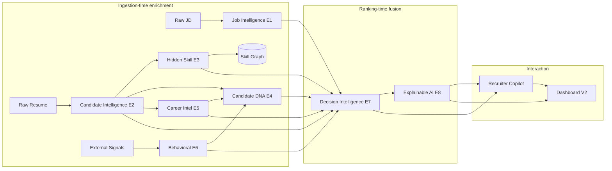

**Read this as two phases**: engines E1–E6 enrich data at **ingestion time** (cached, reusable across ranking runs); E7–E8 + Copilot run at **ranking/interaction time** on top of the cached enrichments. This keeps the interactive path fast.

---

## Updated Data Flow

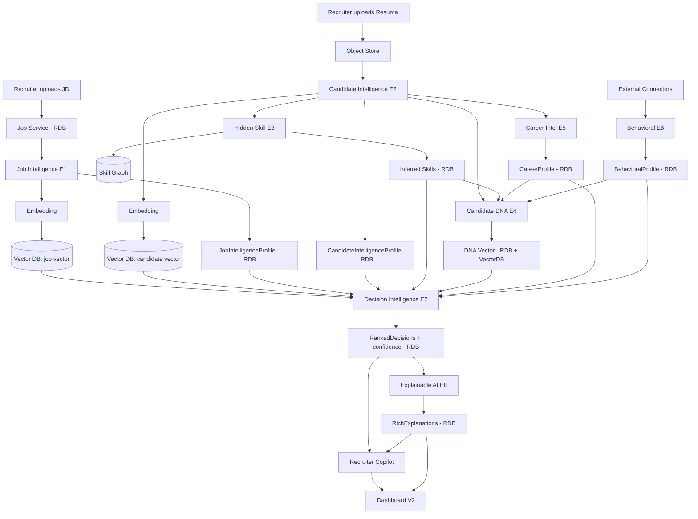

---

## Updated Service Architecture

V1 services are unchanged. V2 adds:

| Service | New? | Responsibility |
|---------|------|----------------|
| Job Service | extended | Now also stores `JobIntelligenceProfile` |
| Candidate Service | extended | Now also stores intelligence/DNA/career/behavioral profiles |
| **AI Engine Service(s)** | **new** | Hosts E1–E6 as stateless, queue-driven enrichment workers |
| Ranking Service | extended | Delegates fusion to Decision Intelligence Engine (E7) |
| Explainability Service | extended | Delegates to Explainable AI Engine (E8) |
| **Copilot Service** | **new** | Conversational orchestrator over all engines (read-only) |
| **Signal Connector Service** | **new** | Pulls/normalizes external signals (GitHub etc.), failure-isolated |
| **Skill Graph Service** | **new** | Serves the ontology for hidden-skill inference |

The engines are deployed as **independently scalable workers** behind the existing queue. Ingestion-time engines (E1–E6) scale with upload volume; interaction-time engines (E7–E8, Copilot) scale with recruiter activity.

---

## Updated Folder Structure

Additions only (V1 tree preserved):

```
services/
├── ai-engines/                  # NEW: the AI Engine Layer
│   ├── job-intelligence/        # E1
│   ├── candidate-intelligence/  # E2
│   ├── hidden-skill-inference/  # E3
│   ├── candidate-dna/           # E4
│   ├── career-intelligence/     # E5
│   ├── behavioral-intelligence/ # E6
│   ├── decision-intelligence/   # E7
│   └── explainable-ai/          # E8
├── copilot/                     # NEW: Recruiter Copilot service
├── signal-connectors/           # NEW: GitHub / coding-platform / portfolio adapters
└── skill-graph/                 # NEW: ontology service

packages/
├── ontology/                    # NEW: skill graph definitions + edge weights
├── archetypes/                  # NEW: Candidate DNA archetype signatures
├── engine-contracts/            # NEW: shared engine I/O types + confidence/provenance
└── scoring/                     # extended: decision fusion + role-adaptive weights

apps/
└── web/
    └── src/features/
        ├── copilot/             # NEW: chat panel
        ├── dna/                 # NEW: DNA visualization
        ├── career/              # NEW: growth prediction views
        └── explainability/      # extended: rich breakdown charts
```

---

## Updated Database Design

V1 stores remain. V2 changes:

- **Relational DB (extended)**: new tables/columns — `job_intelligence_profile`, `candidate_intelligence_profile`, `inferred_skills` (with `source_skills` provenance + confidence), `career_profile`, `behavioral_profile`, `candidate_dna` (archetype affinities), `ranked_decisions` (factor breakdown + confidence), `rich_explanations`, `copilot_conversations`. All enrichment rows carry `engine_version` + `confidence` for governance.
- **Vector DB (extended)**: add a **DNA vector** namespace so "find candidates with similar professional fingerprint to the ideal" becomes an ANN query; job's *desired-DNA* vector enables DNA-compatibility scoring.
- **Graph / Ontology store (NEW)**: holds the Skill Knowledge Graph (skills as nodes; `implies`/`part-of`/`co-occurs` edges with weights). Can start as relational adjacency tables for the hackathon, migrate to a graph DB at scale.
- **External Signal cache (NEW, in Cache/Queue)**: rate-limited, TTL-cached external API results so connectors don't hammer GitHub etc.; absence handled as graceful degradation.

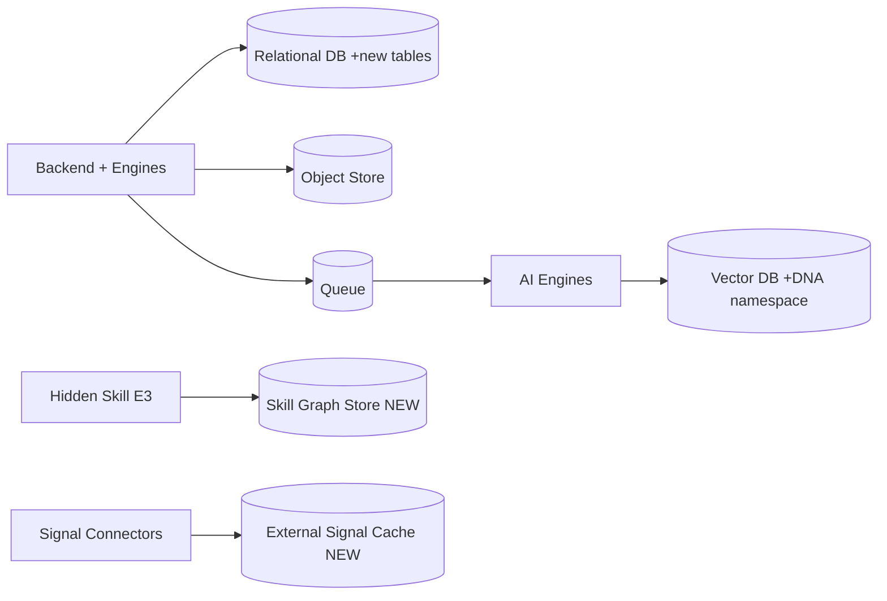

---

## Updated AI Pipeline

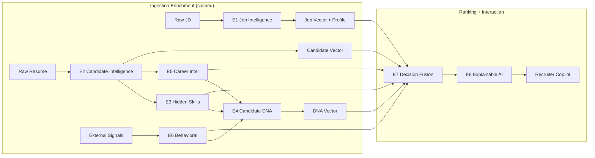

The V1 pipeline (parse → embed → retrieve → score → reason → explain) is now the *spine*; the engines are enrichment and fusion stages layered onto it. The bounded-reasoning and evidence guarantees carry through unchanged.

---

## Updated API Flow

New/changed endpoints (V1 endpoints still valid):

| Method | Path | Purpose |
|--------|------|---------|
| GET | `/jobs/{id}/intelligence` | Job Intelligence profile (E1) |
| GET | `/candidates/{cid}/intelligence` | Candidate Intelligence profile (E2) |
| GET | `/candidates/{cid}/hidden-skills` | Inferred skills + provenance (E3) |
| GET | `/candidates/{cid}/dna` | Candidate DNA affinities (E4) |
| GET | `/candidates/{cid}/career` | Career intelligence metrics (E5) |
| GET | `/candidates/{cid}/behavioral` | Behavioral scores + data confidence (E6) |
| POST | `/jobs/{id}/decision-ranking` | Multi-signal fused ranking (E7) |
| GET | `/jobs/{id}/candidates/{cid}/explanation` | Rich, evidence-backed explanation (E8) |
| POST | `/jobs/{id}/copilot` | Ask the Recruiter Copilot a question |

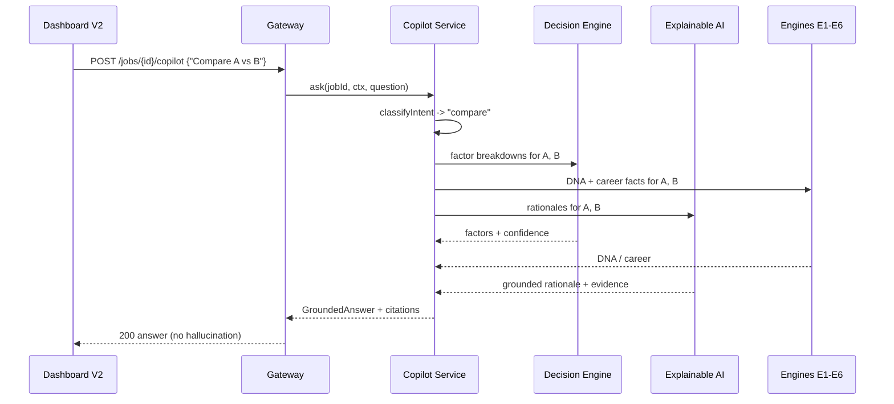

---

## New Dashboard Architecture

A widget-based, evidence-first dashboard. Each widget is fed by a specific engine, so the UI mirrors the architecture.

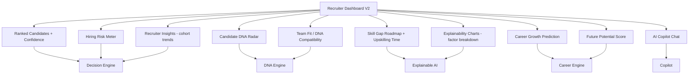

| Widget | Source | What it shows |
|--------|--------|---------------|
| Ranked Candidates | E7 | Ordered list with final score **and confidence** |
| Candidate DNA Radar | E4 | Archetype affinities as a radar/spider chart |
| Skill Gap Roadmap | E8 | Missing skills + estimated upskilling time |
| Career Growth Prediction | E5 | Trajectory + future potential trend |
| Hiring Risk Meter | E7 | Inverted-risk gauge with drivers |
| Future Potential | E5 | Single composite with breakdown |
| Team Fit | E4 | DNA compatibility vs the role's desired DNA |
| Explainability Charts | E8 | Factor-contribution bars (why ranked #N) |
| AI Copilot | Copilot | Conversational Q&A grounded in engines |
| Recruiter Insights | E7 | Cohort-level patterns (e.g., "pool is strong on backend, weak on leadership") |

---

## Innovation Summary

**Why this is superior to a traditional ATS:**

| Traditional ATS | This Platform (V2) |
|-----------------|--------------------|
| Keyword filtering | Semantic + multi-engine reasoning |
| Reads only what's written | **Infers hidden skills** via knowledge graph |
| One opaque score | 9-factor fused score with **explicit confidence** |
| Boolean match | Professional **DNA fingerprint** + trajectory |
| Snapshot of today | **Career prediction** (growth, future potential, promotion readiness) |
| No external proof | **Behavioral intelligence** from real engineering activity |
| "Rejected — no reason" | **Evidence-backed explanations**, no hallucination |
| Static lists | **Conversational Recruiter Copilot** |
| Resume in, list out | Feels like a **senior AI recruiter** advising you |

**Why judges remember it:**
1. **Hidden Skill Inference** — the "wow" moment: the system *knows* a LangChain+FAISS engineer does RAG, and can prove the chain of reasoning.
2. **Candidate DNA** — turns a resume into an intuitive, visual fingerprint (Builder / Researcher / Leader…), instantly graspable on stage.
3. **Recruiter Copilot** — demoable in seconds: "Who can become Team Lead?" → grounded, cited answer.
4. **Trustworthy AI** — every claim is evidence-backed, the LLM is provably bounded (±0.2), and confidence is always shown. This directly addresses the #1 objection to AI hiring tools: *can I trust and defend it?*
5. **Production-credible** — engines are modular, stateless, queue-scaled, versioned, and degrade gracefully. It's a hackathon demo with a real path to deployment.

**Architectural integrity preserved:** every V1 correctness property still holds — scores stay in [0,1], ranking is monotonic and deterministically tie-broken, weights are conserved, reasoning is bounded, and explanations are evidence-complete. V2 adds intelligence *without* weakening any guarantee.
