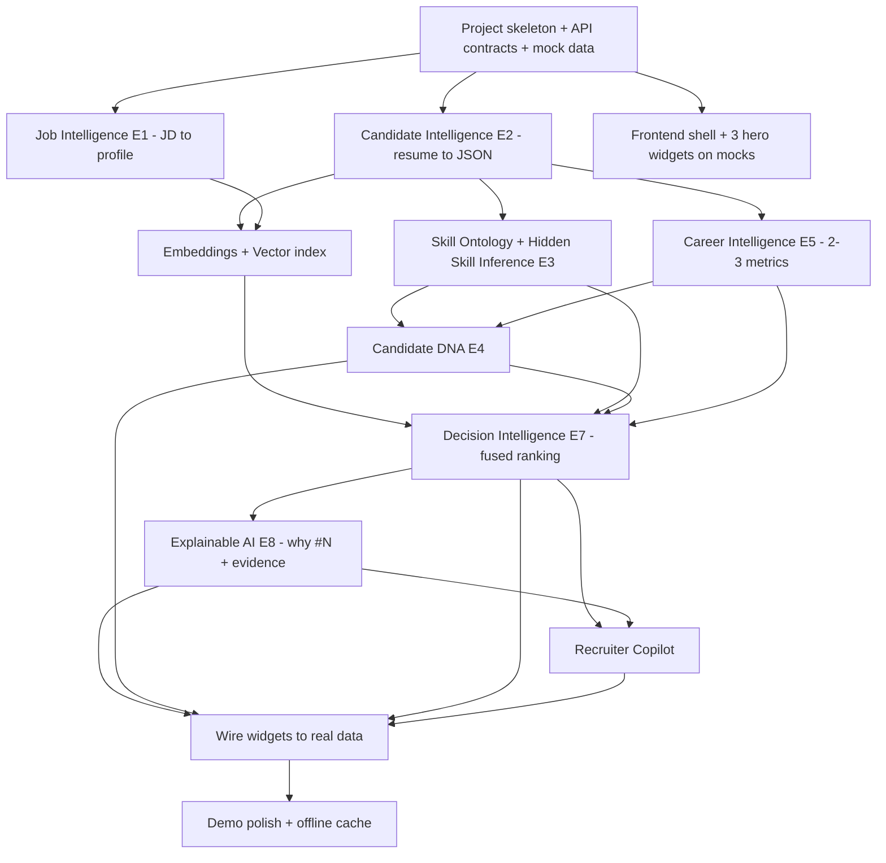

# Product Strategy & Minimum Winning Product (MWP)
### AI Recruitment Intelligence Platform V2 — Hackathon Edition

> **Lens:** Hackathon Judge · Staff PM · Principal AI Architect · Staff ML Engineer · Startup CTO
> **Mandate:** Do not redesign V2. Convert it into the smallest product that delivers the biggest WOW in 24–72 hours.
> **Optimizing for:** Innovation · Demo Quality · AI Capability · UX · Judge Impression. **Not** enterprise completeness.

---

## The One-Sentence Bet

> *"Upload a job description and a stack of resumes, and watch an AI recruiter infer skills nobody wrote down, fingerprint each candidate's professional DNA, rank them with a defensible reason, and answer your questions in plain English."*

If the demo lands that sentence in 5 minutes, we win. Everything below serves that bet.

---

## Step 1 — Feature Prioritization Matrix

Every V2 component classified. **A = must build, B = high impact, C = nice to have, D = post-hackathon.**

| # | Feature / Component | Category | Reasoning |
|---|---------------------|----------|-----------|
| Job Intelligence Engine (E1) | **A 🔥** | Without "hidden requirements," the product is just an ATS. The *inference* is the identity. |
| Candidate Intelligence Engine (E2) | **A 🔥** | Structured profiles are the substrate every other engine reads. Nothing works without it. |
| **Hidden Skill Inference (E3)** | **A 🔥** | The signature "wow." This is the feature judges screenshot. Non-negotiable. |
| **Candidate DNA Engine (E4)** | **A 🔥** | The visual that makes the abstract tangible. Radar chart = instant comprehension on stage. |
| Decision Intelligence Engine (E7) | **A 🔥** | The ranking is the payload. Must fuse signals + show confidence. |
| Explainable AI Engine (E8) | **A 🔥** | "Why #1?" is the question every judge asks. Evidence-backed answer = trust. |
| **Recruiter Copilot** | **A 🔥** | The interactive crescendo. Turns a static demo into a conversation. Highest recall feature. |
| Semantic Matching + Embeddings (V1) | **A 🔥** | Foundation for ranking + hidden-skill corroboration. Already designed; reuse. |
| Career Intelligence Engine (E5) | **B ⭐** | High value (growth/future potential), but can ship with 2–3 metrics instead of 8. |
| Skill Knowledge Graph (ontology) | **B ⭐** | Needed for E3, but a *small curated* graph (50–100 edges) is enough to dazzle. Full graph = D. |
| Dashboard: DNA radar + score breakdown + Copilot | **B ⭐** | The 3 widgets that carry the demo. Build these; defer the other 7. |
| Behavioral Intelligence Engine (E6) | **C 💡** | Great story, but depends on external data. Ship only via uploaded GitHub JSON shortcut. |
| DNA-compatibility vector / Team Fit | **C 💡** | Nice differentiator; only if E4 + time remain. |
| Confidence propagation / signal agreement | **C 💡** | Add a simple confidence number; full propagation math is C. |
| Upskilling-time estimate | **C 💡** | One-line "est. 3 weeks" per gap is cheap and impressive; deeper model is C. |
| Recruiter Insights (cohort trends) | **C 💡** | Only if dashboard time remains. |
| Async queue / background workers | **D 🚫** | Use synchronous calls + a spinner for ≤20 resumes. Queue is production scale. |
| Kubernetes / Helm / autoscaling | **D 🚫** | Docker Compose (or even local) wins the demo. K8s wins nothing on stage. |
| Live GitHub/LinkedIn crawling + OAuth | **D 🚫** | Rate limits + auth = demo death. Upload JSON instead. |
| Dedicated graph DB (Neo4j etc.) | **D 🚫** | A JSON/dict adjacency map is the "graph." |
| Dedicated vector DB cluster (Pinecone prod) | **D 🚫** | `pgvector` or in-memory FAISS is plenty for ≤100 vectors. |
| Multi-tenant auth / RBAC / audit | **D 🚫** | Single recruiter, single session. No login screen in the demo. |
| Idempotency / retries / model governance | **D 🚫** | Real, but invisible on stage. Postpone. |
| Object store (S3) | **D 🚫** | Read uploaded files from local temp dir. |
| Prompt versioning infra | **D 🚫** | Hardcode prompts in a file. |

**Net:** ~8 must-build features form the spine; ~5 high-impact items make it shine; the rest are deliberately cut.

---

## Step 2 — The True WOW Features (judge recall list)

After 50 projects, judges remember *feelings*, not features. These 6 create the feelings.

1. **Hidden Skill Inference** — *the "it can read between the lines" moment.*
   Show a resume with `LangChain, FAISS, LlamaIndex` and the system surfaces **RAG, Vector Databases, LLM Engineering** with a visible chain: *"inferred from 3 corroborating tools."* Judges have never seen a recruiter tool *reason*. This is the screenshot.

2. **Candidate DNA Radar** — *the "I understand this person in 2 seconds" moment.*
   A resume collapses into **Builder / AI Specialist / Leader** on a radar chart. Abstract AI becomes a glanceable picture. Judges grasp it instantly and remember the visual.

3. **Recruiter Copilot** — *the "wait, I can just ask it?" moment.*
   Type *"Who can become a team lead?"* and get a cited, ranked answer. Interactivity converts spectators into believers. Highest recall of all.

4. **"Why ranked #1?" Explainability** — *the "I could actually defend this hire" moment.*
   One click → strengths, gaps, evidence spans, confidence. Directly answers the #1 objection to AI hiring: *can I trust it?*

5. **Bounded, confident ranking** — *the "this AI knows what it doesn't know" moment.*
   Showing a **confidence score** and saying "the LLM can only nudge ±0.2, the math drives the rest" signals engineering maturity. Judges who are engineers love this.

6. **JD Hidden-Requirement Inference** — *the "it understood the subtext" moment.*
   Paste a JD; the system extracts *"startup culture, high ownership, leadership expected"* that were never stated as bullet points. Sets up the whole narrative of intelligence over keywords.

> **Why limit to 6:** A 5-minute demo can land ~6 distinct "moments." More features dilute recall. Each above is a sentence a judge can repeat to another judge — that's how you win deliberation.

---

## Step 3 — The Demo Flow (5-minute script)

Every transition has a job. Total ≈ 5:00.

| Time | Screen / Action | Narration beat | Purpose |
|------|-----------------|----------------|---------|
| 0:00–0:25 | **Hook slide** | "Hiring tools match keywords. Ours *reasons* like a senior recruiter. Watch." | Frame the contrast; set expectation. |
| 0:25–1:00 | **Paste a Job Description** → JD Intelligence panel renders | "It didn't just grab skills — it inferred *startup culture, ownership, leadership expected.* Subtext, not keywords." | WOW #6. Establish "it understands intent." |
| 1:00–1:40 | **Upload 4–5 resumes** → cards appear | "Now real candidates. No keyword filtering happening here." | Set the stage; show scale-in-miniature. |
| 1:40–2:25 | **Open one candidate → Hidden Skills lights up** | "This resume never says 'RAG.' But it lists LangChain, FAISS, LlamaIndex — so the system *infers* RAG, vector DBs, LLM engineering, and shows why." | **WOW #1.** The signature moment. |
| 2:25–3:00 | **DNA Radar renders** | "Here's their professional DNA — Builder, AI Specialist, emerging Leader. A resume in one glance." | **WOW #2.** Visual anchor. |
| 3:00–3:40 | **Ranked list with confidence → click "Why #1?"** | "Ranked by 9 fused signals. Click any candidate: strengths, gaps, evidence, confidence. The LLM can only nudge ±0.2 — the math leads." | **WOW #4 + #5.** Trust + defensibility. |
| 3:40–4:30 | **Recruiter Copilot** — type 2 questions live | "*Who can become a team lead?* … *Who needs the least training?*" → cited answers. | **WOW #3.** The crescendo; interactivity. |
| 4:30–5:00 | **Hiring recommendation + closing** | "From raw files to a defensible shortlist with reasons, in seconds. Not an ATS — an AI recruiter." | Land the one-sentence bet; mic drop. |

**Demo discipline:** pre-load the JD and resumes (no live typing of long text), keep one "hero" candidate that shows the best hidden-skill chain, and rehearse the two Copilot questions so the answers are known-good.

---

## Step 4 — Fake Complexity (impressive but unnecessary for v1)

These look serious in the architecture but win zero judge points in a demo. **Postpone all.**

- **Async queue + background workers** → synchronous calls handle ≤20 resumes fine; a spinner reads as "working."
- **Kubernetes / Helm / autoscaling** → invisible on stage; Docker Compose or local run is enough.
- **Dedicated graph database** → the ontology is a hand-curated dict/JSON; nobody can tell.
- **Production vector DB cluster** → in-memory FAISS or `pgvector` for ~100 vectors.
- **Object store (S3)** → local temp directory.
- **Multi-tenant auth / RBAC / audit trails** → single session, no login.
- **Idempotency, retries, model/prompt versioning** → real engineering, zero demo value.
- **Full confidence-propagation math** → a single heuristic confidence number is convincing.
- **Live external crawling (GitHub/LinkedIn)** → rate limits and OAuth are demo killers.

> Rule of thumb: *if the judge can't see it in 5 minutes, it's not in the MWP.*

---

## Step 5 — Implementation Shortcuts (still impressive)

| Complex subsystem | Shortcut that still wows |
|-------------------|--------------------------|
| GitHub/coding-platform crawling (E6) | **Upload a GitHub JSON export** (or a mock `activity.json`). Same charts, zero auth/rate-limit risk. |
| Skill Knowledge Graph (E3) | **Curated dict of ~50–100 edges** covering AI/ML, DevOps, web. Seed exactly the chains you'll demo. |
| LLM understanding/reasoning (E1, E7, E8) | **Hosted LLM API + a few well-tuned prompts** in a file. No fine-tuning, no self-hosting. |
| Resume parsing (E2) | **LLM-based extraction to JSON** instead of bespoke NLP. One prompt → StructuredProfile. |
| Embeddings + vector search | **`sentence-transformers` + in-memory FAISS** (or `pgvector`). No managed service. |
| Distributed workers | **Synchronous request handling**; show a progress spinner for the batch. |
| Orchestration sagas | **A single function pipeline** calling engines in sequence. |
| Candidate DNA computation | **Weighted feature sums** with a hardcoded archetype signature table. No ML training. |
| Career metrics (E5) | **Ship 2–3 metrics** (growth slope, skill freshness, future potential) computed with simple formulas. |
| Confidence score | **Heuristic**: `coverage_of_available_data × engine_agreement`, displayed as a %. |
| Upskilling time | **Lookup**: `difficulty[skill] × (1 − adjacency)` → "≈ N weeks." |
| Dashboard | **One framework, pre-styled component lib**, 3 hero widgets only. |
| Deployment | **Docker Compose or run-locally**; demo on the dev machine. |

---

## Step 6 — Risk Matrix

| Risk | Type | Probability | Impact | Mitigation |
|------|------|-------------|--------|------------|
| LLM returns malformed JSON, breaks parsing | Technical | High | High | Strict prompt + schema validation + retry-once + fallback to last-good cached parse. Pre-parse demo resumes ahead of time. |
| Live LLM latency stalls the demo | Demo/Perf | High | High | **Pre-compute and cache** all enrichments for the demo dataset before going on stage. Live calls only for the Copilot Q&A (short). |
| Copilot gives a wrong/odd answer live | Demo | Medium | High | Rehearse exact questions; constrain Copilot to provided facts; have a recorded fallback clip. |
| Hidden-skill chain looks arbitrary | Demo | Medium | High | Hand-seed the ontology so the hero resume produces a clean, obvious chain (LangChain→RAG). |
| API rate limits / key quota hit mid-demo | Technical | Medium | High | Cache responses; secondary API key ready; offline cached path for the scripted flow. |
| Embedding/vector index slow on many resumes | Perf | Low | Medium | Cap demo to ≤8 resumes; in-memory FAISS; batch embeddings. |
| Scope creep — building Category C/D | Time | High | High | Freeze scope at end of Milestone 2; a CTO/PM gatekeeper rejects non-MWP work. |
| Integration crunch in final hours | Time | High | Medium | Define API contracts on day 1; build frontend against mock data immediately. |
| Internet/Wi-Fi fails at venue | Demo | Medium | Critical | **Fully offline fallback**: cached responses + local models so the scripted demo runs with no network. |
| Team member blocked on a dependency | Time | Medium | Medium | Dependency graph (Step 7) + mock data so frontend/AI/backend proceed in parallel. |
| Over-explaining architecture, running out of time | Demo | Medium | Medium | Script to 5:00 with a timer; lead with the demo, not the diagram. |

> **The single biggest risk is live latency/flakiness.** The single biggest mitigation is **pre-computing the demo dataset** so the only live AI call is the short Copilot exchange.

---

## Step 7 — Feature Dependency Graph

**Unblock order / critical path:** `Skeleton → E2 (parsing) → {E3, E5, Embeddings} → E4 → E7 → E8 → Copilot → polish`. **E2 is the keystone** — it unblocks everything. The **frontend builds in parallel against mock data** from hour 1 so it's never the bottleneck.

---

## Step 8 — Implementation Roadmap (each milestone = a working demo)

Assumes a 48-hour hackathon with a small team; scale times for 24h/72h.

**Milestone 0 — Foundation (≈ first 10%)**
- Repo skeleton, Docker Compose (or local), LLM + embedding keys verified.
- **Freeze the API contracts** and **demo dataset** (1 JD + ~6 resumes incl. one "hero").
- Frontend shell with the 3 hero widgets rendering **mock** data.
- *Demoable:* clickable UI on fake data — proves the story end-to-end visually.

**Milestone 1 — Understanding (≈ next 20%)**
- E2 Candidate Intelligence (resume → structured JSON via LLM).
- E1 Job Intelligence (JD → profile incl. hidden requirements).
- *Demoable:* paste JD → see inferred subtext; upload resume → see structured profile.

**Milestone 2 — The WOW core (≈ next 25%)**
- Seed Skill Ontology; E3 Hidden Skill Inference with provenance.
- E4 Candidate DNA radar; E5 with 2–3 career metrics.
- Embeddings + in-memory vector index.
- *Demoable:* the hidden-skill chain + DNA radar — **this is the screenshot milestone. Freeze scope here.**

**Milestone 3 — Ranking & Trust (≈ next 25%)**
- E7 Decision Intelligence (9-factor fused score + confidence, bounded ±0.2).
- E8 Explainable AI ("Why #1?", strengths/gaps/evidence/upskilling-time).
- Wire ranked list + explainability widget to real data.
- *Demoable:* full upload → rank → "why?" with evidence.

**Milestone 4 — The Crescendo (≈ next 12%)**
- Recruiter Copilot over the engines (intent routing + cited answers).
- Rehearse the 2 scripted questions.
- *Demoable:* conversational Q&A — the closing beat.

**Milestone 5 — Demo Hardening (final ≈ 8%)**
- **Pre-compute + cache** all demo enrichments; build the **offline fallback**.
- Visual polish, timing rehearsal to 5:00, backup recording.
- *Demoable:* the full, reliable, rehearsed 5-minute run.

> **Golden rule:** every milestone leaves a *showable* demo. If you run out of time after Milestone 2, you still have a wow. After Milestone 3, you can win. Milestone 4 makes you memorable.

---

## Step 9 — Judge Perspective

**What would impress me (as judge):**
- The hidden-skill inference *with a visible reasoning chain* — it's genuinely novel and not a wrapper-around-a-prompt.
- DNA radar: instant, intuitive, screenshot-worthy.
- The honesty: showing **confidence** and **bounding the LLM to ±0.2**. That's engineering maturity most teams skip.
- A working Copilot that *cites* its sources rather than vibing.

**Questions I would ask (prepare answers):**
- *"How do you stop the AI from hallucinating skills?"* → Graph-derived inference is deterministic + provenance-tracked; LLM only fills gaps under stricter caps; explanations are verified against evidence.
- *"How is this different from feeding resumes to ChatGPT?"* → Bounded, weight-conserved scoring; reproducible ranking; evidence-backed explanations; structured engines, not one prompt.
- *"How do you handle bias / fairness?"* → Scoring excludes protected attributes; everything is auditable and evidence-based; humans decide. (Designed in V1.)
- *"Does it scale?"* → Engines are stateless and modular; the architecture has a real production path (queue, vector DB, K8s) we deliberately stubbed for the demo.
- *"What's real vs. mocked?"* → Be honest: parsing/inference/ranking/Copilot are real; external signals are uploaded JSON; deployment is local. Honesty earns trust.

**Weaknesses I'd notice (and how we frame them):**
- Small/curated ontology → frame as "seeded for demo, designed to scale via graph store."
- External behavioral data is uploaded, not live → frame as "connector-ready, auth deferred."
- Few resumes → frame as "architecture is vector-indexed for thousands; capped for demo clarity."

**How it becomes a winning submission:**
- Lead with the demo, not the architecture. Land all 6 WOW moments cleanly.
- Tell a *story* (intent → inference → DNA → defensible decision → conversation), not a feature list.
- Show the trust/maturity angle — it separates you from "another GPT wrapper."
- Have the offline fallback so nothing breaks. **A flawless 5-minute run beats a feature-rich crash.**

---

## Step 10 — Final Output Summary

**Minimum Winning Product (MWP):**
> A single-session web app where a recruiter pastes a JD and uploads ~6 resumes. The system shows **inferred hidden JD requirements**, per-candidate **inferred hidden skills with provenance**, a **DNA radar**, a **confidence-scored fused ranking**, an **evidence-backed "Why #1?"**, and a **Recruiter Copilot** that answers questions with citations. Everything for the demo is pre-computed/cached with an offline fallback. Built on hosted LLM + embeddings, in-memory vector search, a curated skill ontology, and a 3-widget dashboard — run locally via Docker Compose.

**Build Order (critical path):**
`Skeleton + contracts → E2 parsing → {E3 hidden skills, E5 career, embeddings} → E4 DNA → E7 ranking → E8 explainability → Copilot → cache/offline + polish` (frontend on mocks in parallel from hour 1).

**Milestones:** M0 Foundation → M1 Understanding → M2 WOW core (scope freeze) → M3 Ranking & Trust → M4 Copilot crescendo → M5 Demo hardening. Each is independently demoable.

**Time Estimation (48h baseline; ÷2 for 24h emphasis, ×1.5 headroom for 72h):**

| Milestone | Share of time | 24h | 48h | 72h |
|-----------|---------------|-----|-----|-----|
| M0 Foundation | ~10% | 2–3h | 5h | 7h |
| M1 Understanding | ~20% | 5h | 9–10h | 14h |
| M2 WOW core | ~25% | 6h | 12h | 18h |
| M3 Ranking & Trust | ~25% | 6h | 12h | 18h |
| M4 Copilot | ~12% | 3h | 6h | 9h |
| M5 Hardening/polish | ~8% | 2h | 4h | 6h |

**Winning Strategy (the 5 levers):**
1. **Win on 6 memorable moments**, not 30 features.
2. **Pre-compute the demo** so the only live call is a short, rehearsed Copilot Q&A.
3. **Sell trust** (confidence + bounded LLM + evidence) — it's the differentiator from GPT wrappers.
4. **Build the frontend on mocks from hour 1**; parallelize via the dependency graph.
5. **Freeze scope at M2.** Discipline beats ambition in a 48-hour window.

**Final Recommendation:**
Build the **A 🔥** features end-to-end, add the **B ⭐** dashboard widgets and 2–3 career metrics, and ruthlessly defer everything **D 🚫**. Treat the Hidden Skill chain, DNA radar, and Copilot as the three non-negotiable hero moments. Rehearse a flawless, offline-capable 5-minute run. The goal isn't the most complete product — it's the most *memorable, trustworthy, and clearly intelligent* one. That combination is what wins hackathons.
